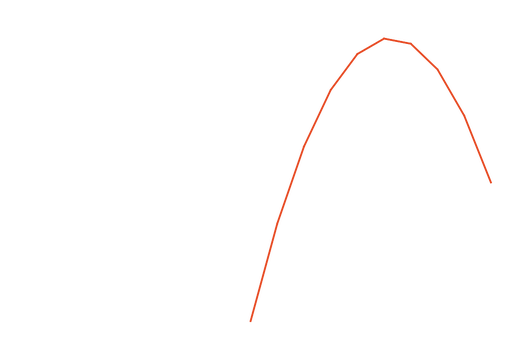
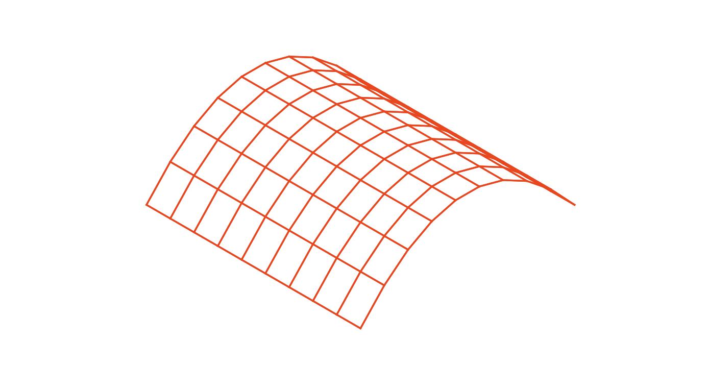
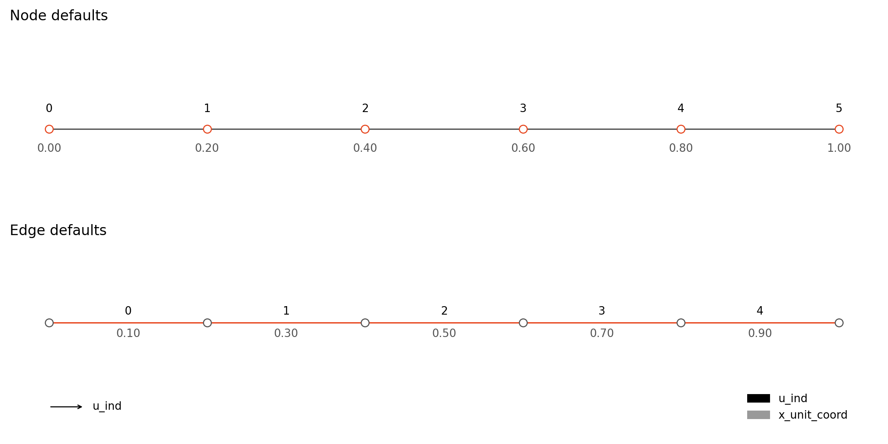
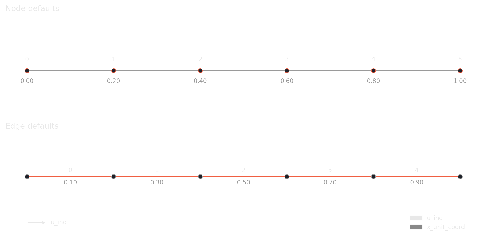
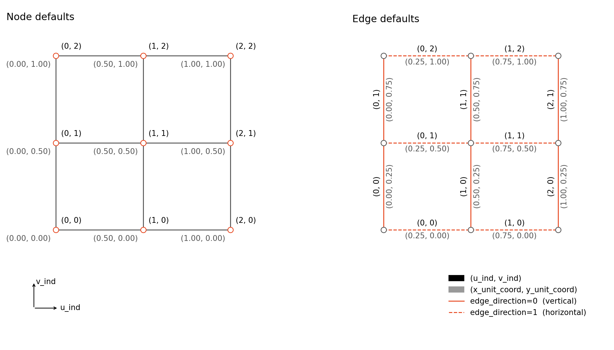
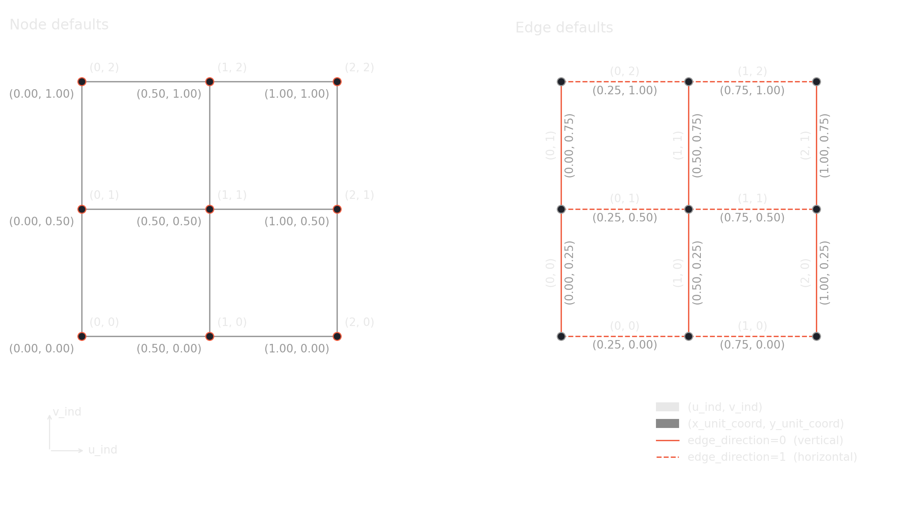
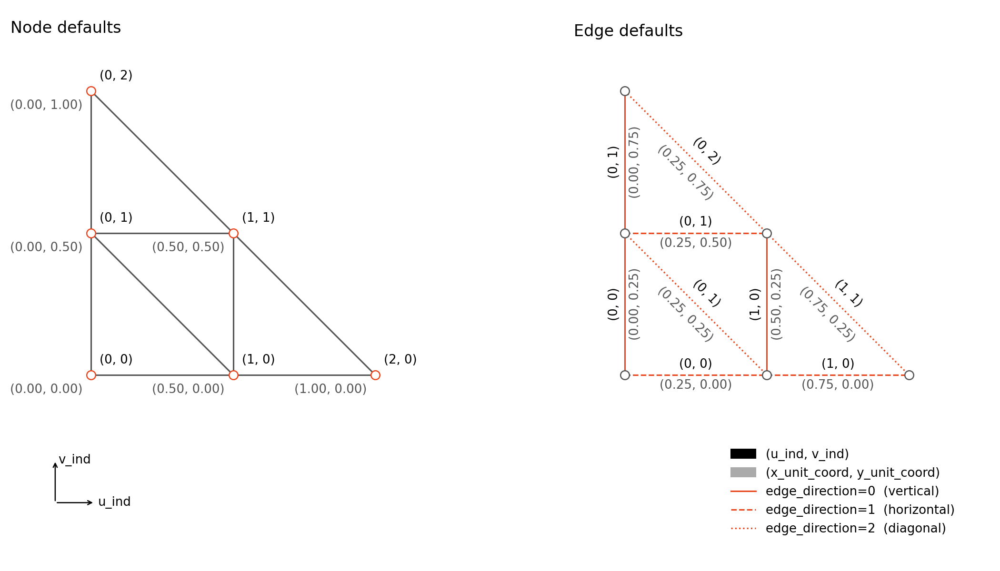
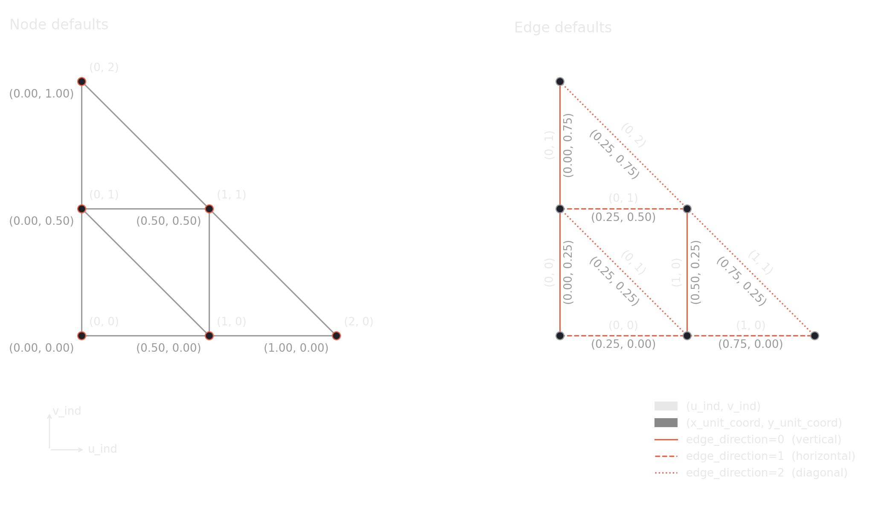
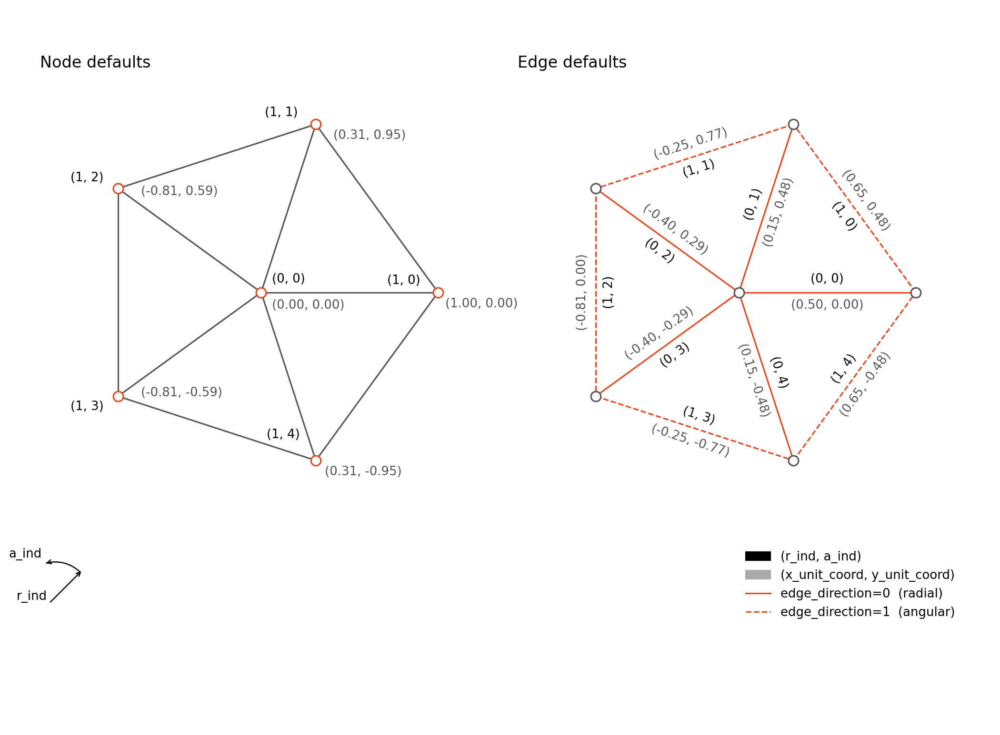
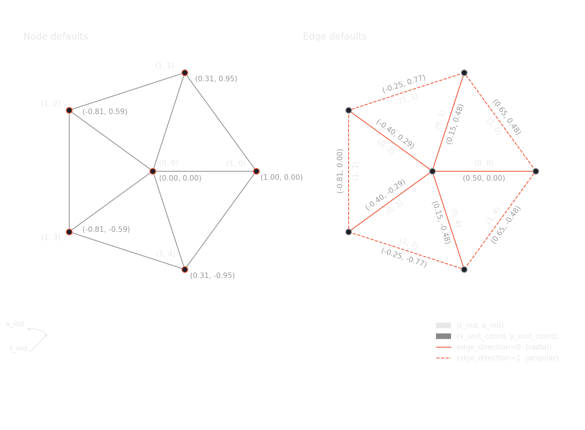

# Tutorial: Topology Creation 

Welcome to the topology creation tutorial for `torch_structure`. If you have not installed `torch_structure` yet or had problems with the installation process, please refer to the [installation guide](install.md).


TorchStructure's topology functions all follow the same template. First, we will start with a simple chain. 

---

## A simple chain

We start by creating an empty `StructData` graph. Node and edge attributes are registered as dictionaries of empty tensors, where the tensor shape defines the attribute's dimension. In this example, nodes carry 3D coordinates and edges have a material id.

```python
import torch
from torch_structure.data.data import StructData
import matplotlib.pyplot as plt

node_attrs = {"coords": torch.empty((0, 3), dtype=torch.float)}
edge_attrs = {"material_id": torch.empty((0,1), dtype=torch.long)}
data = StructData(node_attrs=node_attrs, edge_attrs=edge_attrs)
```
Values for node and edge attributes are also assigned via dictionaries, with attribute names as keys and either tensors or callables as values. The details of how the callables work are explained below. For now, it suffices to understand that node coordinates are computed by callable `compute_coordinates` that takes unit coordinates in x-direction as an input and maps them to a parabolic arch. A uniform edge material id is set directly with a tensor.

```python

num_nodes = 10

material_id = torch.ones(num_nodes - 1, 1, dtype=torch.long)

def compute_coordinates(x_unit_coord):
    height = 3 * x_unit_coord * (1 - x_unit_coord)
    return torch.hstack([x_unit_coord, torch.zeros_like(x_unit_coord), height])

node_attrs = {"coords": compute_coordinates}
edge_attrs = {"material_id": material_id}

data.add_chain(num_nodes, node_attrs=node_attrs, edge_attrs=edge_attrs)
```

Visualize the result. The plot function automatically recognizes the `coords` attributes and realizes the graph based on it. The `material_id` attribute has no impact on the plot, as it is just information stored on the graph.
```python
data.plot()
plt.show()
```

{: .ts-fig--light }
{: .ts-fig--dark }

---

## A grid 

A grid has `N = n × m` nodes and `E = n(m-1) + m(n-1)` edges. We register the same attributes as before and create an empty `StructData` object.

```python
import torch
from torch_structure.data.data import StructData
import matplotlib.pyplot as plt

node_attrs = {"coords": torch.empty((0, 3), dtype=torch.float)}
edge_attrs = {"material_id": torch.empty((0, 1), dtype=torch.long)}
data = StructData(node_attrs=node_attrs, edge_attrs=edge_attrs)
```

In a similar fashion as before, node coordinates are set with a callable that uses both `x_unit_coord` and `y_unit_coord`, mapping the unit square to a tonne (barrel vault) shape: arched along `x` with a shallow curve, and straight along `y`. Edge attributes are again a constant tensor.

```python
num_rows, num_cols = 10, 10
num_edges = num_rows * (num_cols - 1) + num_cols * (num_rows - 1)

material_id = torch.ones(num_edges, 1, dtype=torch.long)

def compute_coordinates(x_unit_coord, y_unit_coord):
    height = 1.2 * x_unit_coord * (1 - x_unit_coord)
    return torch.hstack([x_unit_coord, y_unit_coord, height])

node_attrs = {"coords": compute_coordinates}
edge_attrs = {"material_id": material_id}

data.add_grid(num_rows, num_cols, node_attrs=node_attrs, edge_attrs=edge_attrs)
```

Visualize the result.
```python
data.plot()
plt.show()
```

{: .ts-fig--light }
{: .ts-fig--dark }


---

## The general pattern

All topology functions ([`add_chain`][torch_structure.data.data.StructData.add_chain], [`add_grid`][torch_structure.data.data.StructData.add_grid], [`add_triangular_grid`][torch_structure.data.data.StructData.add_triangular_grid], [`add_polar_grid`][torch_structure.data.data.StructData.add_polar_grid]) follow the same pattern.

Their input consists of `node_attrs` and `edge_attrs` as arguments for the graph's attributes as well as some integers to specify the topology's resolution. The amount of these integers corresponds to their shape parameters. E.g. a grid is determined by two, an isosceles triangle by one shape parameter.

The dictionary keys have to be any of the attributes specified when the graph is created. Attributes that are not in `node_attrs` or `edge_attrs` but were registered in the graph at creation, will be filled with default values or, if none were specified, with zeros. 

The dictionary values are either a tensor or a callable that returns a tensor. In both cases the resulting tensor must have shape `[N, *]` for node attributes or `[E, *]` for edge attributes, where the trailing dimensions match those registered on the `StructData` object for the same attribute. For a tensor as a dictionary value, a shape of `[1, *]` is also accepted and broadcast uniformly over all nodes or edges.

### How callables work

When a dictionary value is a callable, `torch_structure` resolves its inputs by name. It inspects the callable's parameter names and passes the matching tensors as arguments. Two sources are available:

- **Default attributes**: each topology function pre-computes a set of suitable attributes (node indices, unit coordinates, boundary flags, etc.) that can be used directly as callable inputs. See the API reference for the full list per function.
- **Previously defined attributes**: any attribute already set earlier in the *same* dictionary is also available as a callable input. This allows attributes to be built up step by step — for example, registering `height` first and then passing it into the callable that computes `coords`:

    ```python
    node_attrs = {
        "height": torch.empty((0, 1), dtype=torch.float),
        "coords": torch.empty((0, 3), dtype=torch.float),
    }
    data = StructData(node_attrs=node_attrs)

    def get_height(x_unit_coord):
        return 3 * x_unit_coord * (1 - x_unit_coord)

    def get_coords(x_unit_coord, height):
        return torch.hstack([x_unit_coord, torch.zeros_like(x_unit_coord), height])

    node_attrs = {
        "height": get_height,
        "coords": get_coords,
    }
    data.add_chain(10, node_attrs=node_attrs)
    ```

The callable's return value is subject to the same dimension requirements as a direct tensor. If you want to use default attributes, make sure the arguments of your callable match the default attribute names specified in the API reference exactly.

---

## Default attributes for all topology functions.

### Add chain

{: .ts-fig--light }
{: .ts-fig--dark }

### Add grid

{: .ts-fig--light }
{: .ts-fig--dark }

### Add triangular grid

{: .ts-fig--light }
{: .ts-fig--dark }

### Add polar grid

{: .ts-fig--light }
{: .ts-fig--dark }
